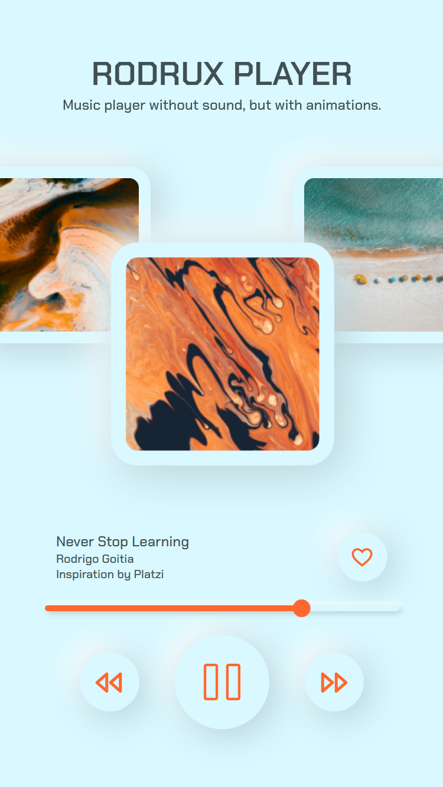

# Rodrux Player

This project is a practice to create a layout with neomorphism and animations with CSS.

All the feedback and contributions are welcome. 🙋🏾

## Features

- Change “songs” with animation.
- Play, pause and restart progress bar.

## Run  the project

To run the this project you can use any server to run the index.html file.

For example: “Live Server” from Visual Studio Code.

## Built with

Technologies used in the project:

- JavaScript Vanilla
- CSS3
- HTML5

## License

> This project is licensed under the MIT License
> 

## **Author**

Made with 💚 by [rodruxdev](https://twitter.com/rodruxdev)